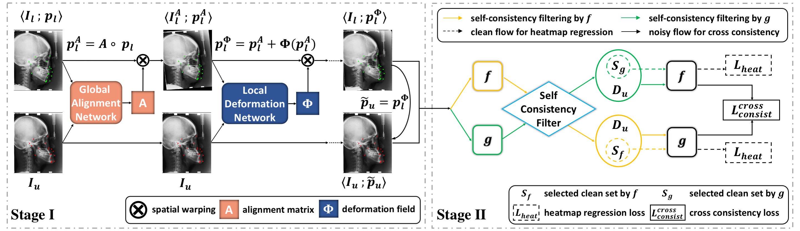

# EdgeTrans4Mark
pytorch implementation of ECCV2022 "One-Shot Medical Landmark Localization by Edge-Guided Transform and Noisy Landmark Refinement"


## Dataset
- hand dataset: download from [IEEE ISBI2015 Challenge](http://www-o.ntust.edu.tw/~cweiwang/ISBI2015/challenge1)
And prepare your data like this:
```txt
${CEPHA_ROOT}
`-- RawImage
    `-- TrainingData
    `-- TestData1 
    `-- TestData2
`-- anno
    |-- train_ann.json
    |-- test1_ann.json 
    |-- test2_ann.json
`-- semi
    |-- oneshot_id.txt
```


## Requirements
```py
pip install requirements.txt
```
  
## Training & Testing
### Stage1
- Step1: unsupervised edge-guided transform learning
```py
python scripts/train_st1.py \
--cfg experiments/cephalometric/train_st1.yaml \
--gpus {GPUS}
```

- Step2: infer pseudo landmarks for unlabeled data  
```py
python scripts/valid_st1.py \
--model-file {model_path} \ 
--gpus {GPUS} --local-iter 4 --infer-train
```
where {model_path} denotes the trained model in step1.

### Stage2: Retraining with noise-filtering and semi-supervised learning 
- Step3: train a new detector with one-shot gt & inferred labels
```py
python scripts/train_st2.py \
--cfg experiments/cephalometric/isbi_150_320x256_retrain_crop_ssl.yaml \
--gpus {GPUS} --method c2teach
```

## Acknowledgements 
Great thanks for the following works and their opensource codes [HRNet](https://github.com/leoxiaobin/deep-high-resolution-net.pytorch), [DETR](https://github.com/facebookresearch/detr).
